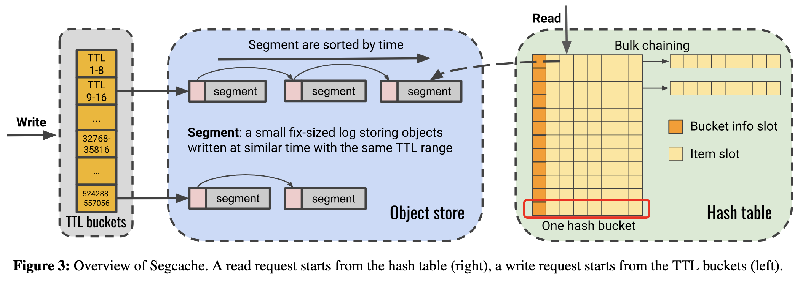
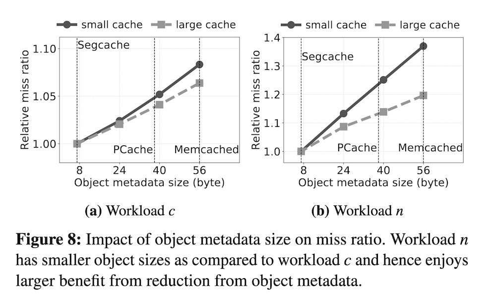

+++
title = "Segcache: a memory-efficient and scalable in-memory key-value cache for small objects"
[extra]
bio = """ """
[[extra.authors]]
name = "David Luo (leader)"
[[extra.authors]]
name = "Nanda Velugoti (blogger)"
[[extra.authors]]
name = "Eugene Cohen (Scribe)"
[[extra.authors]]
name = "Rabecka Moffit"
[[extra.authors]]
name = "Benjamin Knutson"
+++

# Introduction 
Modern web applications use in-memory key-value caches such as Memcached and Redis to ensure fast response times and high throughput. However, these systems have some drawbacks, including high metadata overhead, inefficient expiration management, and challenges with scalability. This paper presents Segcache, a new caching solution that addresses these issues by reimagining the way objects are stored and managed.

# Segcache Implementation

Segcache takes a different approach. TTL-indexed segment chains group objects that have similar creation and expiration times, making it easier to expire and evict a bunch of data at the same time. Metadata sharing reduces per-object overhead down to just 5 bytes, a 91% reduction compared to Memcached, by merging the metadata into shared segment headers. Instead of evicting objects one by one, merge-based eviction removes entire segments, keeping the more frequently accessed data while still getting memory space back.

# Results

These optimizations lead to significant performance gains. Compared to existing caching systems, Segcache uses 22-60% less memory and compared to Memcached on a single thread, it delivers up to 40% better throughput. It also scales pretty well, achieving an 8x speedup over Memcached with 24 threads.

# Discussion

One thing I found interesting was that Segcache doesn't need to do a full-cache scan in order for it to remove expired objects, which helps improve its efficiency, but also reduces the overhead seen in traditional caching systems.

- **Q:** What is the granularity at which locks are used? A: Just have locks at segment granularity.
- Segment can have objects that are modified by two clients at a time - if puts are run concurrently could get invalid state of segment so need to enforce mutual exclusion to ensure correctness,
- **Q:** What do the dotted lines in the graph (Fig 8 in [cite]) below represent? A: The dotted lines represent the metadata size in each implementations. Smaller the object metadata size, the better miss ratio. Authors of the paper should've explained this better in the paper.

- **Q:** Everywhere in the paper authors say relative miss ratio, i.e. relative to production [cite slide], etc, why show against production?  **A:** They had to pick something, If not in production why would they choose it?
- Patterns along the gray bars in graphs are better for readability.
- **Q:** What is the relation ship between objects and segments? **A:** Objects are contained in segments. We could have key just in segments, all the segments get populated with just key updates.  Have to have some way to collapse them.
- **Q:** In the author's presentation video, they claim that S3 gets filled you just add segment to end.  But segment is fixed size, how does that work?  **A:** If you run out of slots in a segment you add a new one.  There's no limit on the number of segments but each is fixed size.  If you fill one up you add a new one. Also, the number of buckets are fixed then the length of linked list is arbitrary.
- **Q:** How do you read objects?  Do you have to walk multiple segments or just one?
- TTL is not just a technical requirement but also a legal one (GDPR law passed in EU).
- Apparently there are people already building off of segcache.  Students in Australia are building hypercache building off of this.  Took bucket idea and expiration. [cite]
- SQLite has an in-memory implementation, and does not work with multi-threaded apps, does not have proper locking and documentation says is unsafe.  Nevertheless companies still use it. Sometimes you want to do a JOIN.  Moderns DBMS have on-the-fly JOINs.
- **Q:** Does persistent storage have to be disk?  **A:** LSM trees are usually designed for SSDs.  When talking about flash storage you have to worry about wear-leveling, so if you just take a naive log structured implementation you could wear out cells if you don't implement compaction carefully.
- **Q:** Benefits of log-structured trees? **A:** many log structured systems batch writes so for correctness they need to be careful to get proper results.

# Conclusion

# References
