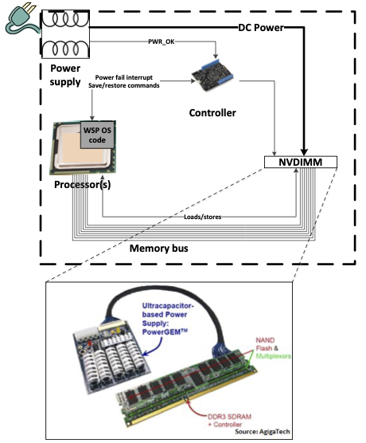
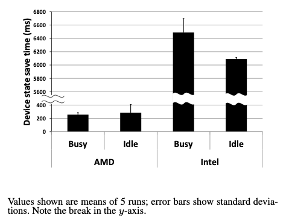
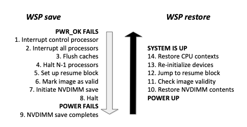
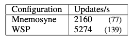
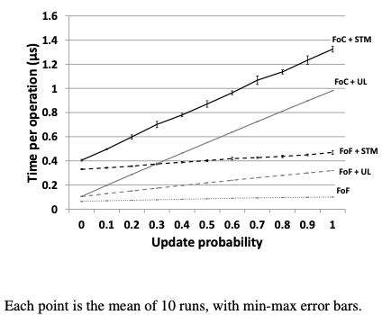

+++
title = "WSP: Whole System Persistence"
[extra]
bio = """
  Rabecka Moffit is an electrical engineering student pursuing a M.Eng. and a B.S at Oregon State University who enjoys gravel biking, surfing, and baking.
"""
[[extra.authors]]
name = "Rabecka Moffit (leader)"
[[extra.authors]]
name = "Benjamin Knutson (scribe)"
[[extra.authors]]
name = "Eugene Cohen (blogger)"
[[extra.authors]]
name = "Nanda Velugoti"
[[extra.authors]]
name = "David Luo"
+++

# Background

We've historically viewed the memory hierarchy as volatile main memory and secondary persistent storage.  With the OS and programs executing directly form main memory, the secondary storage is viewed as a final resting place for persistency of data (and sometimes for additional memory through swapping).  With this primary-volatile, secondary-non-volatile model in mind, advancements have been made over decades in how operating systems and applications use storage, from filesystems to databases supporting transactional storage.

But if all of main memory becomes inherently non-volatile then many of these past conventions get disrupted - having the program itself and the data it is operating on directly persist across power loss and multiple boots presents its own set of opportunities and numerous new challenges as well.  The Whole System Persistence paper examines a solution built on non-volatile main memory.

# Overview

## Problem Statement

Many modern Internet services are built around memory-based key-value stores for speed.  When a server hosting one of these in-memory databases must be rebooted, it can take a significant amount of time and/or a significant load on secondary storage devices to reload data from secondary storage to main memory.  An example cited in the paper was an outage from Facebook in 2010 which suffered 2.5 hours of downtime due while in-memory cache servers reloaded data.  If this secondary storage bottleneck could be eliminated it could substantially improve the time to recovery.

The paper states that previous solutions like persistent buffer caches, which use block-based/filesystem storage as well as persistent heap-based solutions require state to be duplicated between memory and storage and also argues that it effectively "doubles the memory footprint" of these applications.  (But read below, for a critical analysis of this statement.)

## Whole-System Persistence (WSP)

The Whole-System Persistence design uses non-volatile NVDIMM memory to retain *all* DRAM state across failures, effectively converting a failure into a suspend/resume event.  No changes are required to applications, although performance optimizations may be desirable.

In this diagram we see the NVDIMM, which contains DDR DRAM and NAND flash and can autonomously transfer data from DRAM to NAND on command.  For the purposes of saving state at power loss, saving DRAM to NAND Flash alone is not sufficient.  The processor (and in some architectures the chipset) contains caches which must be flushed.  And to preserve program state so we can resume at the next Program Counter value without restarting the processor register context must be saved as well, in much the same manner as a thread context switch.  So at power loss there must be saving of processor state (of all cores), flushing of caches and then finally instructing the NVDIMM to transfer DRAM to Flash.

### Save and Restore Flow

To ensure a complete system state save there must be sufficient energy available to support continuing to execute for the processor state-save handling as well as from the DRAM->NAND Flash transfer.  This energy would be supplied through capacitors, either auxiliary capacitors to provide non-volatility or by leveraging the bulk capacitance in the system power supply.  (See criticism below on the power supply capacitance characterization work however.)

What is the best way to preserve all of main memory on power loss?  The paper characterized the device state transition time to go to D3, the device state used for suspend-to-ram (ACPI S3) and suspend-to-disk (ACPI S4).  They show that on their two testbed systems that these transitions do not meet the time requirement for sufficient "residual energy":

Instead the solution was to rely on an optimized suspend path that saved processor state but did not involve device drivers.  (The paper did not address how device drivers were expected to recover from these conditions as their hardware state is reset.  This could be a serious limitation for applying WSP to existing operating systems.)

## NVRAM Programming Models: Block-Based, Persistent Heap versus Whole-System

| Persistence Model | Pros                                              | Cons |
|--------------------------|--------------------------------------------|---------------------------------------------------------|
| Block-Based              | Works with existing storage models         | Log/journal for reliability, slow recovery |
| Persistent Heaps         | In-memory updates, faster than block-based | Non-transparent for app, requires transactional updates |
| Whole System Persistence | Instant recovery, transparent to apps*     | Requires system-wide NVRAM more expensive (today) |
---
`*` but if apps already use other techniques then they still need to be modified!

### Block-based: serialize data and write to a file or database
Application must convert data to the storage format on each update and back again on recovery.  Additional application overhead is implied by block storage. 
 
 
### Persistent heaps: use a transactional API to update persistent objects
Some objects are placed in a persistent heap and use specialized APIs to ensure consistency.  These APIs implement a transaction model ensuring an all-or-nothing update model implying a log-structured implementation.  The paper states that the flush-on-commit methodology required by persistent heap implementations incur significant runtime overheads.
 
 
### Whole system: all objects are in-memory, all state restored transparently
All application memory is non-volatile.  Only transient state of the execution must be flushed to memory.  The paper says this is better for legacy applications which are not written for separation of persistent and volatile state.
 
The paper states that persistent heaps with transactional characteristics are inherently worse than whole-system persistency and if necessary using transactional mechanisms where needed to achieve recovery goals.  The difference is that the transactional API is not imposed everywhere with whole-system persistence.

The paper proposes adopting a flush-on-fail to capture transient processor and cache state only during failures intead of a flush-on-commit method used to write state to persistent storage during operation.  The idea is that the overhead of flushing data to secondary storage can be eliminated.  (But see criticism below about the detectability of all failures.)

# WSP Performance Results

The WSP paper evaluated the performance changes resulting from adopting flush-on-fail instead of flush-on-commit in two workloads.

One workload is based on OpenLDAP which inserts 100,000 random entries into a directory, comparing the Mnemosyne NV-heap solution which employs flush-on-commit versus WSP which employs flush-on-fail.  For the purposes of WSP in this context, the flushing -- transational instrumentation and logging -- is simply removed.  As expected there is a substantial uplift in performance for WSP.  (Is this a realistic modification?  Would in-memory database be able to recover under all interruption scenarios after the outright removal of these layers?  It's unclear.)

The second workload is a hash table benchmark using a pre-populated table of 100,000 entries with 1,000,000 random operations applied to it, either a key lookup or update (insert/delete).  Multiple configurations were tested to separate out the effects of Software Transactional Memory (STM - the default Mnemosyne config), Undo-Logging (UL, an alternative approach in lieu of STM) and the flush-on-fail which elides both methods:

Overall we see the WSP FoF is 6-13x faster than the default FoC+STM configuration.  In addition to the speedups we expect by removing STM and UL, we also observe that WSP even with STM or UL is substantially faster for writing data so even if transactional methods are retained the persistency of main memory still confers a great benefit.

 
# Analysis

## Thoughts on Transient Power Loss

Intro says saving transient state takes less than 5ms across a range of platforms and says power supplies provide 10-300ms of uptime.  A production system will need a highly deterministic power delivery system so the power usage of the system and capacities of power supply must be carefully scrutinized and characterized.  This become more difficult with expansion - for example a high power consumption coherent CXL device may consume enough power that the transient uptime requirement is violated.
 

Need to be careful that all components retain their ability to operate during the transient condition.  Imagine a multi-rack interconnect that participates in a hardware coherency protocol and one rack loses power before the other.  What is necessary to be able to complete the necessary flushes to persistent memory under these complex topologies?
 
 

### Synchronizing Device State on Recovery

The authors considered using the ACPI-defined suspend-to-RAM model for saving and restoring device state during these transactions but the save significantly exceeded the residual energy window.  (Aside: The S3 model is intended for client systems where latencies of multiple seconds to transition may be considered acceptable so it's not surprising that this is ill-suited.). They suggest an approach where there is no save phase of for the devices and instead deal with the mess on the way back.
 
The authors state that a virtualization environment could resolve this as the VM paradigm already supports the suspension and resumption of VM guests.  The hypervisor / host OS could be booted cold and then VMs restored from their persistent state.  This approach leverages the device driver model and recovery of the hypervisor drivers is nothing more than cold boot.  This still amounts to an effective surprise-suspension of a VM guest but the limited device drivers in that model make the recovery problem more manageable.  This approach was not yet implemented at the time of writing.
 

 # Strengths and Weaknesses

Paper says that traditional block storage techniques store data in two locations (RAM and disk) and hence "doubles the application's memory footprint".  This is a bit unfair as the NVDIMM also doubles the memory footprint across a DRAM and Flash, the difference being that both memories reside on the same device instead of on different ones.  And from a price perspective the more specialized NVDIMM may be cost prohibitive compared to commodity RAM and storage devices.  Will the cost increase of NVDIMMs justify the benefits of persistence versus storage-backed schemes?
 
The paper spent a lot of effort characterizing power supplies examining residual energy on power loss.  But the paper fails to realize that residual energy is not a design goal of power supplies on commodity devices, in fact in some cases minimizing residual energy is a goal to ensure safe component replacement.  (Imagine the electrical issues that may arise if your motherboard power supplies remained energized for a couple minutes after being switched off while you were swapping DIMMs or PCIe cards!)

How is recovery from arbitrary interruption handled?  Is the application expected to resume at the next Program Counter value as if nothing had happened?  As we know from advanced power-management schemes this is quite difficult in practice as the state of external hardware and systems must be re-synchronized.  How realistic is this for applications that may have shared state with HW devices (accelerators, storage and networking)?  The paper implies that applications are inherently prepared to handle this kind of transition but there is not data to support this.
 
An over-arching assumption is that the platform is able to detect these interruptions and trigger the flushing and persistent storage write.  How realistic is this?  We know that systems can hang, operating systems and even firmware can crash/panic.  Reliable server systems have had FMEA studies done already - how well does the Whole System Persistence stand up to the variety of failure modes we can imagine for a server?
 
What happens if the application crashes and the crash state is persistent?  How does one recover from this?  The paper states "In our model, NVRAM is the first but not the last resort for recovery after a crash failure. Recovery from a back-end storage layer such as a file system or database will always be necessary in some cases, e.g., if an entire server fails." but this implies that the back-end storage will still need to be written.  Please enlighten us with how we can accomplish this with whole-system persistence in place!

* Step 11 checks image validity, how do they actually do this? They use a commit record, when flushing a state you stamp that record with a completion stamp when it’s done so you know what has been completed. You boot the computer if there is a commit record if not then you did not make it in time and then you crash.

## Other Questions and Comments from Class Discussion

* This paper used faults of power supplies as an expectation (residual power supply energy), if the capacitor fails then there won't be residual power to use.  This points out the broader issue that the paper is focused on a single failure mode only.

* They say that the recovery time is instant but we know NAND flash takes time to write and to read back.  The paper does not characterize these times and these will create a bound on recovery time.

### Virtualization's Role in WSP
* Virtualization may help solve the device state problem.  For guests using virtualized devices (e.g. virtio) the state of these IO interfaces are held in memory itself (e.g. virtio ring buffers) and will be saved and restored with the rest of memory. But modern techniques that expose host devices directly the guest, like PCIe pass-through of a GPU, will still have the device save-restore problem.

* Would checkpoint restart work here? You periodically dump a checkpoint and then you have to start from the latest checkpoint. This system is for a processors most up to date state being saved rather than a close-by restart

### Practical Considerations
* If my application is based on time, it’s about to do something based on time and it fails and a restore happens what happens if the shutdown is for a long time. What happens to the state of a program that cares about time? How does the program that gets rebooted know how much time has passed? 

* How do you determine what memory is important and what memory is not important, how do you sort volatile memory and nonvolatile memory in this system?

* How would things like OS kernel or application updates work?  What does it mean to reboot a system for updating or crash recovery if main memory is the primary point of persistence?  There is a lot more operating systems work to do to address these issues.

* What state is your memory in if it’s failed and you reboot?  What do you recover/reload from if the whole point is to sever ties to secondary storage?

* There are security concerns since someone could just take your memory and plug it into a different computer and read it.

## Final Thoughts

The WSP paper poses an important question about the implications of main-memory non-volatility.  It shows distinct benefits from eliminating writes to secondary storage and the overhead associated with transactional updates but it leaves unanswered a bunch of new questions around device driver impacts, reliability across failure modes, and implications for OS and application updates, providing ample opportunities for Systems researchers.

## Sources
- https://www.microsoft.com/en-us/research/wp-content/uploads/2016/02/paper-updated.pdf

