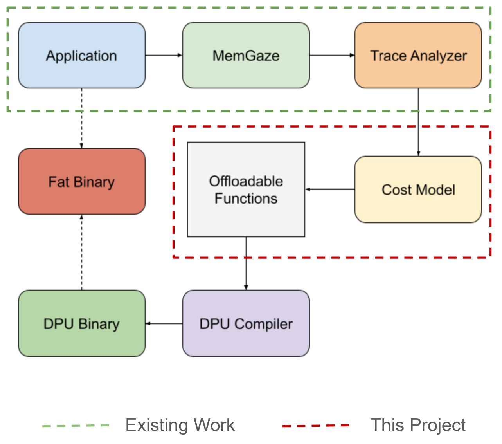
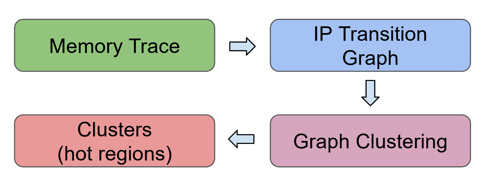
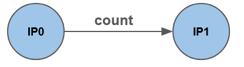
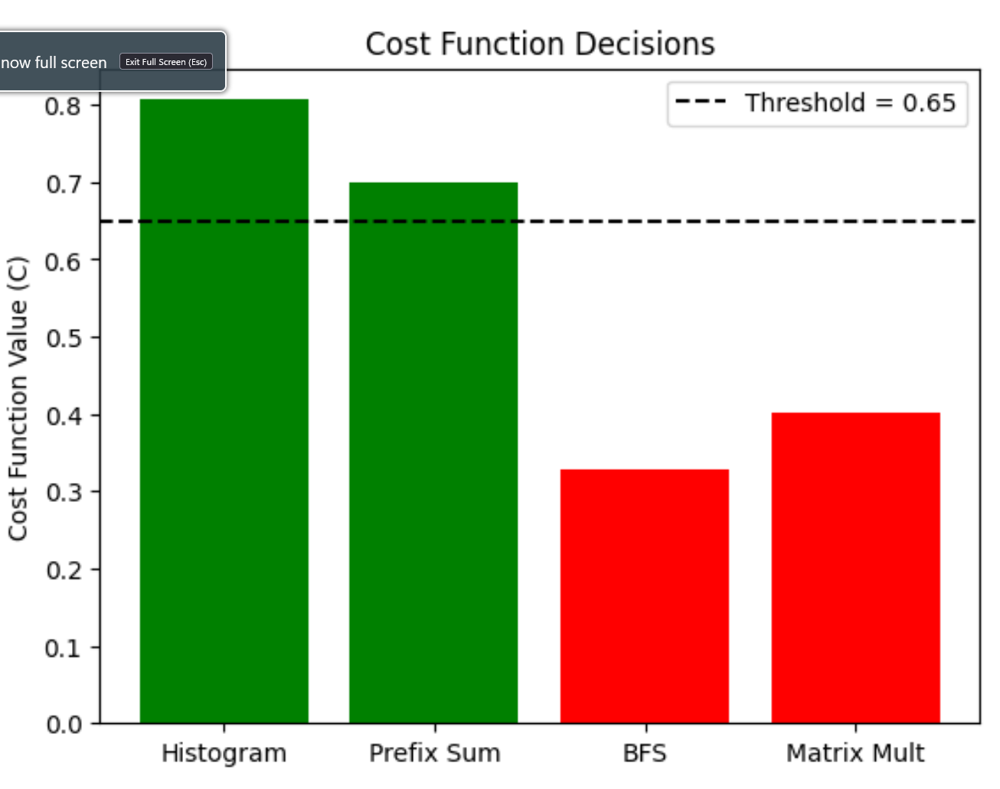
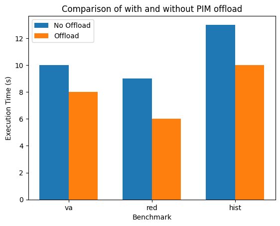
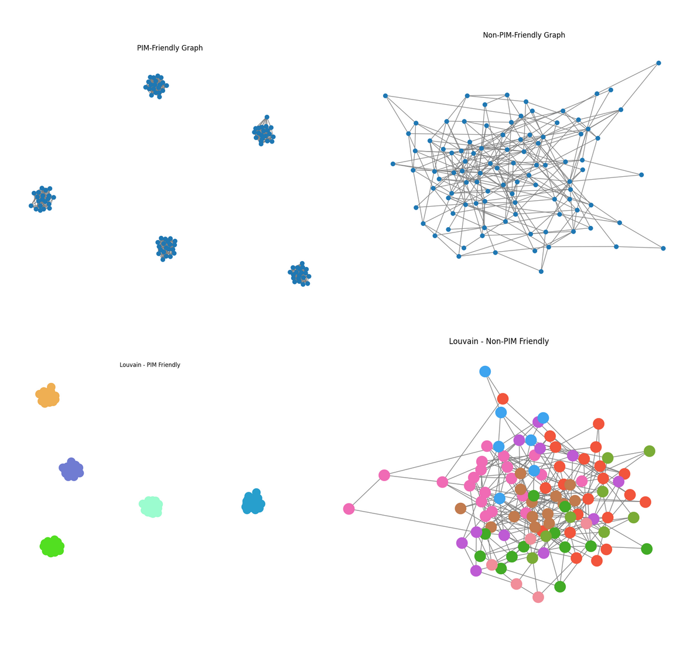
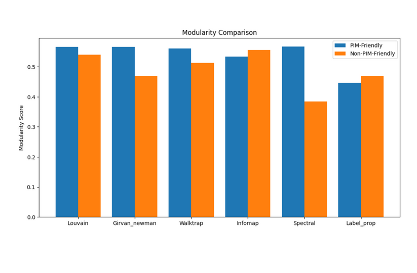
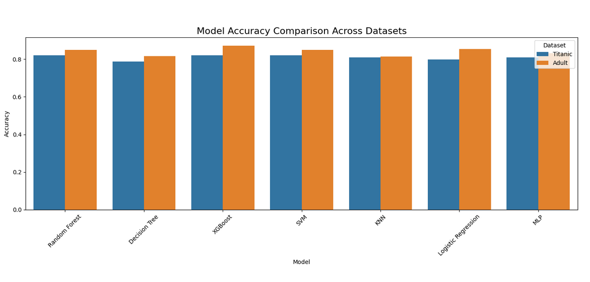
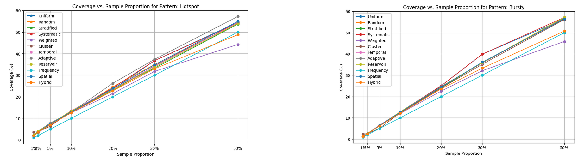
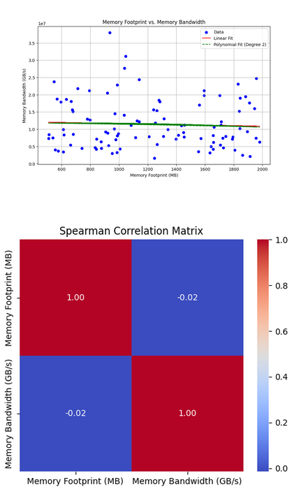

+++
title = "Automatic offloading of memory-intensive compute to nearby PIM modules"

[[extra.authors]]
name = "Nanda Velugoti"
[[extra.authors]]
name = "Noah Bean"
+++

# Introduction

PIM (Processing-In-Memory) is a computing paradigm where memory intensive operations are executed in DPUs (DRAM/Data Processing Units) that are situated near if not within the DRAM (main memory) chip. PIM enables near data processing leading to higher memory bandwidth utilization and higher overall performance in workloads that consist of memory-intensive operations. This is true because PIM computation bypasses multi-level cache accesses in CPU avoiding all the costs associated with such accesses. The result is improved scalability and performance in many parallel workloads. This is extensively studied in research works such as PRIM benchmarks and SimplePIM framework.

However, these frameworks require programmers to be aware of applications' dynamic memory characteristics to properly modify the program and re-compile it to reap the benefits of PIM offloading. But, in many cases, this is not necessarily true. To solve this, we propose automatically detecting memory-intensive parts of an application and offload that piece of computation to a nearby PIM device. We use memory profiling and analysis tool, MemGaze, to collect memory traces and metrics. We then use this data to extract memory-intensive regions ("hot sequences") of the program. 

A major challenge however is, how do we decide which functions are worth offloading to nearby PIM processors? To solve this problem we construct a cost model that takes in memory related metrics and clusters as input and output an associated cost for code regions. We can then use the cost to make the offload decision. This is the core contribution of this project.

# Background

## MemGaze
MemGaze is a low overhead memory analysis tool that provides dynamic memory traces and memory access metrics such as footprint, re-use distance. MemGaze is also capable of analyzing the memory access patterns from the dynamic trace and classifies them into sequential, strided, indirect accesses. MemGaze injects `PTWRITE` instruction for each LD/ST instruction in the target application binary. MemGaze then runs this instrumented binary to collect memory access samples and generates a whole program dynamic trace. These traces are further analyzed to generate aforementioned memory metrics and access classifications.

## UPMEM PIM Chips
UPMEM's special DRAM chip come with general purpose DPUs (DRAM/Data Processing Units) which enables PIM programming. UPMEM provides Linux kernel drivers, an SDK and a custom compiler to develop PIM programs that can run in these DPUs. Programmers can use UPMEM's host API to initialize, launch and orchestrate DPU programs from the host (CPU) program.

# Design and Implementation (The Goal)
Since this project is part of much bigger on-going project we outline the scope of this project in the below high level diagram i.e., the green highlighted area is the existing work and red high lighted area is the scope of this project.

As the figure above illustrates, we designed a novel cost model to capture the cost of offloading compute (further discussed in "Cost Model" section). Before we talk about cost model, we first need to explain how we detect the memory intensive regions of a program. For this we use, MemGaze to collect traces and characterize the memory access intensity by using graph clustering to extract "hot sequences" as explained below.

## Memory Characterization

Steps to extract memory-intensive regions:
1. Collect the dynamic memory trace using MemGaze
2. Construct the IP (instruction pointer) transition graph where, `IP0` is followed by `IP1` `count` number of times

3. Use Louvain clustering algorithm to cluster the transition graph
4. The clustered sub-graphs represent the “hot sequences” (memory intensive) code regions.

## Modifying MemGaze

MemGaze outputs FP and RUD metrics at function level as an inclusive metric, i.e., if `main()` calls `foo()` (memory intensive function), `main()`'s footprint includes the footprint of`foo()`. This is not desirable because `main()` would be characterized as memory-intensive which is not true. To fix this, we edit MemGaze internals to spit out exclusive FP and RUD metrics for functions.

## Cost Model (What Was Done)

A cost function model was devised to access if a code region should be offloaded to UPMEM PIM hardware: 
> `C = W1 * F_PIM-norm + W2 * R_amortize + W3 * L_modularity.`

`F_PIM-norm` is a term that quantifies how well a workload’s characteristics match the strengths of UPMEM PIM architectures. Specifically, it aggregates and scales factors such as Compute to Memory Ratio (CMR), Footprint (FP), Memory Bandwidth Demand (MBD), Access Intensity (AI), Parallelism Potential (PP), and Reuse Distance (RD). 

> `F_PIM-norm = w1 · RD + w2 · AI + w3 · PP − w4 · CMR + w5 · MBD − w6 · FP`

The `R_amortize` term quantifies whether the execution time of a workload on UPMEM PIM justifies the overhead of offloading it from the host CPU.

The `L_modularity` term assesses how well a workload’s memory access patterns can be partitioned into clusters suitable for UPMEM’s Data Processing Units, each with 64 MB of local DRAM.

Based on the synthetic testing done (explained in the "Exploring/Investigating" section), we set,

> `W1 = 0.3, W2 = 0.5, W3 = 0.2, Offload when C < 0.65`

# Evaluation (Were We Successful)

## Test setup: 

- INTEL(R) XEON(R) SILVER 4509Y
- 32 Cores, 500G RAM
- UPMEM Functional Simulator
- Benchmarks are run with single thread implementation
- Offload if cost > threshold

## Benchmarks

- Vector Addition
- Reduction
- Histogram

## Cost breakdown for Vector Addition

| Function			| Offload Cost (0 to 1) |
| --------------|-----------------------|
| `main`  			| 0.8                   |
| `init_arrays`	| 0.6                   |
| `vector_add`	| 0.4                   |

## Speed up due to offloading

# Challenges (The Hardest Parts To Get Right)

- Which clustering algorithm is more suitable for PIM based workloads?
- Which metrics are useful for the cost function?
- How to choose coefficients for cost function?

## Testing related challenges:
- Upmem sdk + simulator learning curve
- NixOS learning curve

## Exploring/Investigating PIM suitable Metrics and Clustering Algorithms

## Louvain vs Other Clustering Algorithms

Louvain was previously used for clustering MemGaze IP transition graphs, but after investigation, it was discovered that Leiden delivered better accuracy (0.145 score vs. Louvain 0.142), 3.5x faster inference speed (14.39s vs. 49.76s), and better scalability (16362.5 vs. 85218.7 ratio). Leiden should be used in the final cost function, but Louvain is fine for the MVP.

## Linear Regression vs other ML Models

The cost model relies on a linear regression-based approach to compute `F_PIM-norm`, assessing PIM-friendliness for UPMEM offloading. On a synthetic dataset of 31 workloads, it achieved 87.1% accuracy and 100% recall, correctly identifying all PIM-friendly cases, but its precision (81.82%) reflects some false positives, like misclassifying compute-heavy workloads due to a low threshold. Compared to XGBoost, which scored 90.32% accuracy and 92.74% ROC-AUC, linear regression trades precision (81.82% vs. 89.47%) for perfect recall, missing no offloading opportunities. XGBoost, with a 94.44% recall, missed a few PIM-friendly cases but balanced this with fewer errors (F1: 91.89% vs. 90.00%), leveraging non-linear modeling for better calibration (MAE 0.1698 vs. 0.4917, R² 0.6224 vs. -0.1578).
For the MVP, linear regression’s simplicity (50 lines, no training) and interpretability outweigh XGBoost’s complexity (100 lines, training required), despite the latter’s edge in accuracy and robustness. XGBoost’s explainability concerns can be mitigated with tools like LIME and SHAP, making it a strong candidate for the final cost function model.

## Uniform vs Other Sampling Methods

MemGaze uses uniform sampling to get memory traces. Uniform sampling is fine given its alignment with Intel PT’s high-speed, low-overhead requirements, especially for mixed or unknown hardware trace patterns. Its performance at low proportions (2%-5% coverage at 1%-2%) is acceptable as a general-purpose method, and its simplicity ensures it will not bottleneck tracing. However, for workloads with predictable patterns such as periodic loops or hotspots, a pattern-aware switch to Cluster or Adaptive sampling could improve coverage without sacrificing speed. For the MVP, Uniform at 1%-2% can be used, and if profiling reveals pattern-specific deficiencies, implement Adaptive sampling.

## Bandwidth and Footprint/Footprint Growth Correlation

Memory bandwidth and footprint (F) or footprint growth (ΔF) show little correlation across general workloads, as F reflects capacity, not access activity, while bandwidth depends on patterns and frequency. In UPMEM HPC tests (Vector Addition), a weak positive link (~0.24) emerged between bandwidth and ΔF when F exceeded cache or used sequential access, hitting UPMEM’s 50 GB/s cap. High Bandwidth Utilization (BWU, memory accesses per cycle over compute instructions) above 70% improved offloading success, though low locality or floating-point demands capped efficiency due to UPMEM’s compute limits. Thus, while F and ΔF alone don’t predict bandwidth broadly, they tie modestly to PIM gains where memory dominates, leading the cost model to favor BWU and access patterns over raw F.

# What Was Surprising

Comment from Noah:

> "Reality was more robust than academia led me to believe. I thought that picking specific methods like Louvain or Leiden, linear regression or XGBoost, uniform or adaptive sampling would make or break the results, but the less complicated methods did just fine."

# Future Extensions

## Model
- Improve model iteratively
- Measure the accuracy of model
- Implement as a runtime library

## Implement remaining steps
- Automatically compile DPU binary
- Create combined host+DPU fat binary

## Benchmarks
- Evaluate remaining workloads from SimplePIM paper
- Repeat this on real-world applications

# Conclusion

In conclusion, we have presented the idea of automatically detecting memory intensive parts of a program and proposed a cost model that can be used to select which of those memory intensive parts need to be offloaded to a PIM device. In addition, we have explored various memory metrics and graph clustering algorithms to find a suitable candidate that can capture PIM memory characteristics. Finally, we have evaluated our approach on three different representative benchmarks, showing speedup of up to 1.3x.

# References
1. [A Modern Primer on Processing-In-Memory](https://arxiv.org/pdf/2012.03112)
2. [Benchmarking a New Paradigm: An Experimental Analysis of a Real Processing-in-Memory Architecture](https://arxiv.org/abs/2105.03814)
3. [SimplePIM: A Software Framework for Productive and Efficient Processing-in-Memory](https://dl.acm.org/doi/10.1109/PACT58117.2023.00017)
4. [MemGaze: Rapid and Effective Load-Level Memory Trace Analysis](https://ieeexplore.ieee.org/document/9912656)
5. [UPMEM SDK](https://www.upmem.com/developer/)

# Division of Responsibilities
- Nanda: Initial project setup, design, implementation and evaluation
- Noah: Constructing/investigating cost model, PIM-friendly metrics and evaluation
- Both of us equally contributed to slides and blog post write up.

